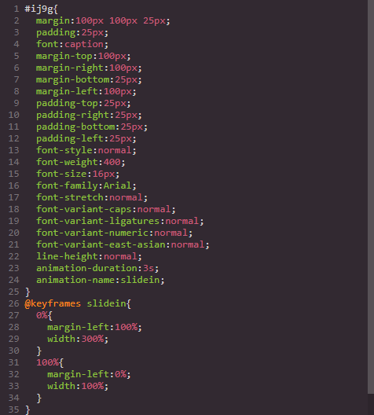
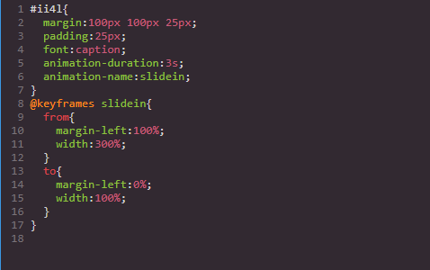

# Grapesjs Component Code Editor

A plugin that allows you to edit the code of a component that is selected on the canvas

<p align="center">
 
</p>

[DEMO](https://codepen.io/ju99ernaut/pen/RwaqwPQ)

>Recommended-use [grapesje-parser-postcss](https://github.com/artf/grapesjs-parser-postcss) with this plugin to avoid issues with `styles` as the default parser is inconsistent and will add a lot of extra rules to your css, more explained [here](https://grapesjs.com/docs/guides/Custom-CSS-parser.html#cssom-results-are-inconsistent)

| Chrome Result | PostCSS Result |
|--------|---------|
|<p align="center"></p>|<p align="center"></p>|

### HTML
```html
<link href="https://unpkg.com/grapesjs/dist/css/grapes.min.css" rel="stylesheet">
<script src="https://unpkg.com/grapesjs"></script>
<link href="https://unpkg.com/grapesjs-component-code-editor/dist/grapesjs-component-code-editor.min.css" rel="stylesheet">
<script src="https://unpkg.com/grapesjs-component-code-editor"></script>

<div id="gjs"></div>
```

### JS
```js
const editor = grapesjs.init({
	container: '#gjs',
  height: '100%',
  fromElement: true,
  storageManager: false,
  //...
  panels: {
    defaults: [
      {
        buttons: [
          //...
          {
            attributes: { title: 'Open Code' },
            className: 'fa fa-code',
            command: 'open-code',
            id: 'open-code'
          }
          //...
        ],
        id: 'views'
      }
    ]
  },
  //...
  plugins: ['grapesjs-component-code-editor'],
});
```

### CSS
```css
body, html {
  margin: 0;
  height: 100%;
}
```


## Summary

* Plugin name: `grapesjs-component-code-editor`
* Commands
    * `open-code` - opens code editor in right panel
    * `code-editor-object` - get new instance `CodeEditor` object
    * `code-editor-constructor` - get `CodeEditor` constructor


## Options

| Option | Description | Default |
|-|-|-
| `panelId` | Id of panel to append code editor | `views-container` |
| `appendTo` | Append code editor to an element not `views-container` | ` ` |
| `openState` | Determine width of views panel and canvas in the open state | `{...}` |
| `closedtate` | Determine width of views panel and canvas in the closed state | `{...}` |
| `clearData` | Remove all `gjs-data` attributes from the component | `false` |
| `codeViewOptions` | Code view/editor options | `{}` |
| `editJs` | Lets you edit component scripts `allowScripts` must be set to true | `false` |
| `cleanCssBtn` | /Used to remove css from the Selector Manager | `true` |
| `htmlBtnText` | Save HTML button text | `Apply` |
| `cssBtnText` | Save CSS button text | `Apply` |
| `cleanCssBtnText` | Clean HTML button text | `Delete` |

>Tip-[grapesjs-script-editor](https://github.com/Ju99ernaut/grapesjs-script-editor) is better suited for editing scripts instead of using `editJs`, reason being `editJs` will inject scripts as separate components onto the canvas which often interferes with the main editor. [grapesjs-script-editor](https://github.com/Ju99ernaut/grapesjs-script-editor) avoids this by injecting scripts directly into a component therefore avoiding the use of `allowScripts`.

>`cleanCssBtn`-When you delete a selector in the `code-editor` it is still in the `Selector Manager` therefore it will still affect the component after saving, this button removes the selector from both the `code-editor` and `Selector Manager`. Only valid css rules can be removed eg `.class{ color: blue }`

## Download

* CDN
  * `https://unpkg.com/grapesjs-component-code-editor`
* NPM
  * `npm i grapesjs-component-code-editor`
* GIT
  * `git clone https://github.com/ju99ernaut/grapesjs-component-code-editor.git`


## Usage

Directly in the browser
```html
<link href="https://unpkg.com/grapesjs/dist/css/grapes.min.css" rel="stylesheet"/>
<script src="https://unpkg.com/grapesjs"></script>
<link href="./dist/grapesjs-component-code-editor.min.css" rel="stylesheet">
<script src="./dist/grapesjs-component-code-editor.min.js"></script>

<div id="gjs"></div>

<script type="text/javascript">
  var editor = grapesjs.init({
      container: '#gjs',
      // ...
      panels: { /* add panel button with command open-code */}
      plugins: ['grapesjs-component-code-editor'],
      pluginsOpts: {
        'grapesjs-component-code-editor': { /* options */ }
      }
  });
</script>
```

Modern javascript
```js
import grapesjs from 'grapesjs';
import plugin from 'grapesjs-component-code-editor';
import 'grapesjs/dist/css/grapes.min.css';
import 'grapesjs-component-code-editor/dist/grapesjs-component-code-editor.min.css';

const editor = grapesjs.init({
  container : '#gjs',
  // ...
  plugins: [plugin],
  pluginsOpts: {
    [plugin]: { /* options */ }
  }
  // or
  plugins: [
    editor => plugin(editor, { /* options */ }),
  ],
});
```

Adding after `editor` initialization
```js
const pn = editor.Panels;
const panelViews = pn.addPanel({
  id: 'views'
});
panelViews.get('buttons').add([{
  attributes: {
     title: 'Open Code'
  },
  className: 'fa fa-file-code-o',
  command: 'open-code',
  togglable: false, //do not close when button is clicked again
  id: 'open-code'
}]);
```


## Development

Clone the repository

```sh
$ git clone https://github.com/ju99ernaut/grapesjs-component-code-editor.git
$ cd grapesjs-component-code-editor
```

Install dependencies

```sh
$ npm i
```

Start the dev server

```sh
$ npm start
```

Build the source

```sh
$ npm run build
```


## License

MIT
